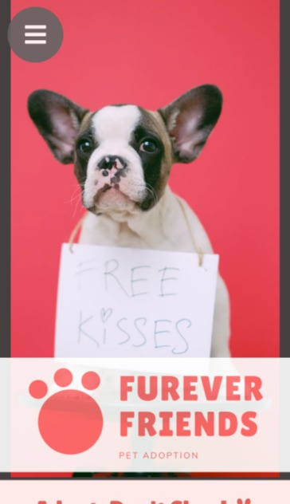

# Furever-Friends

  Furever Friends is an app that allows users to search and browse for adoptable dogs and cats, as well as animal shelters! Furever Friends utilizes the PetFinder API to display adoptable cats and dogs within a given area and also uses the Gnews API to display articles related to featured pets of the week.

Technologies used include HTML, CSS, JS, & jQuery.

Live App
https://jwebb8137.github.io/Furever-Friends/
